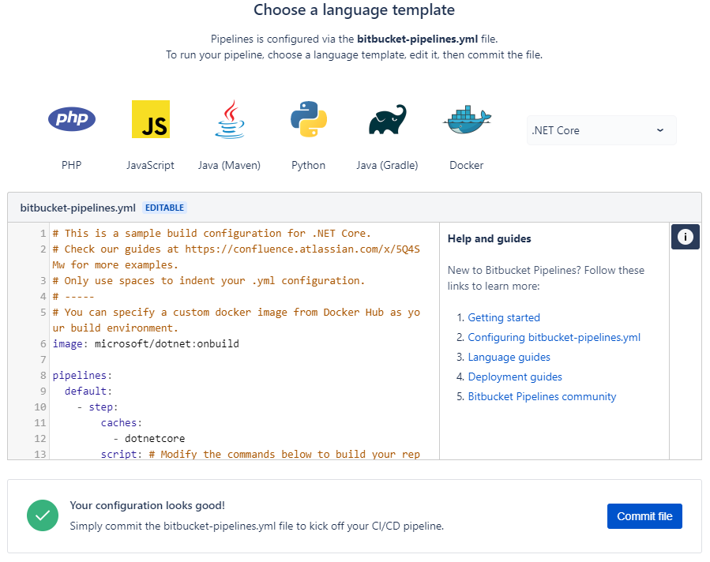
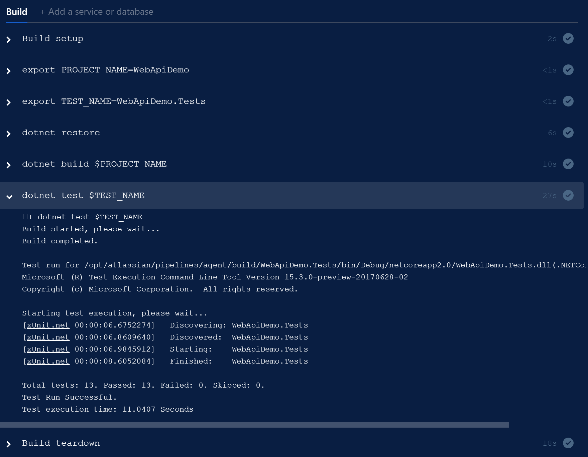
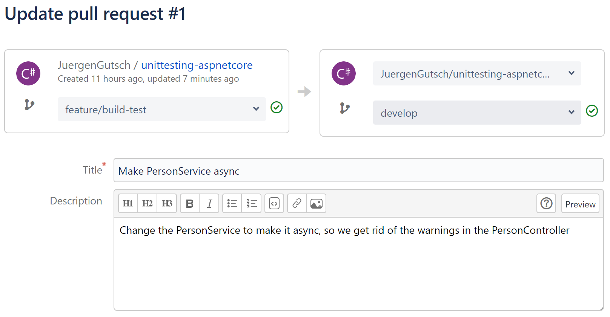
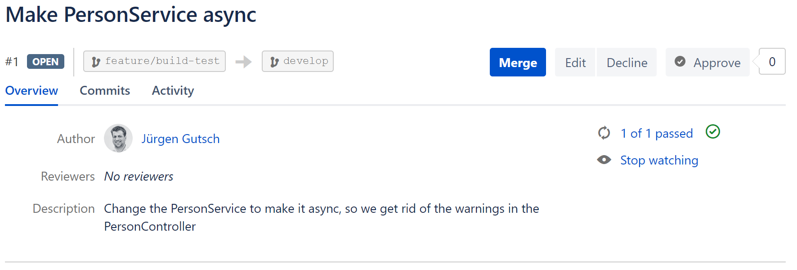
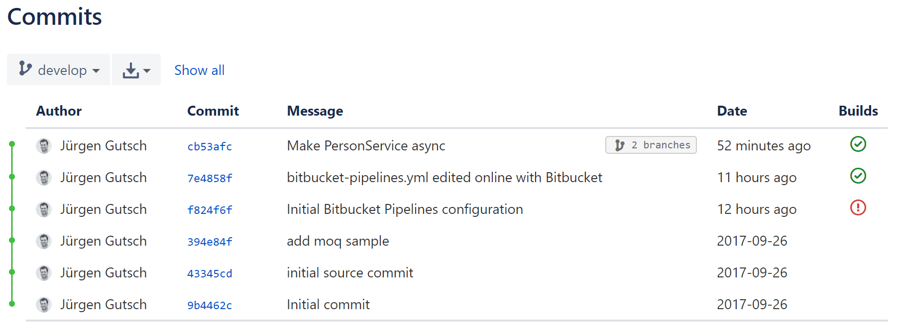

BitBucket provides a continuous integration tool called Pipelines. This is based on Docker containers which are running on a Linux based Docker machine. Within this post I wanna try to use BitBucket Pipelines with an ASP.NET Core application.

In the past I preferred BitBucket over GitHub, because I used Mercurial more than Git. But that changed five years ago. Personally I use GitHub for every new project. But at the [YooApps](http://yooapps.com) we use the entire Atlassian ALM Stack including Jira, Confluence and BitBucket. (We don't use Bamboo yet, because also use Azre a lot and we didn't get Bamboo running on Azure). BitBucket is a good choice if you anyway use the other Atlassian tools, because the integration is awesome. 

Since a while, Atlassian provides Pipelines as a simple continuous integration tool directly on BitBucket. You don't need to setup Bamboo to build and test just a simple application. At the [YooApps](http://yooapps.com) we actually use Pipelines in various projects which are not using .NET. For .NET Projects we are currently using CAKE or FAKE on Jenkins, hosted on an Azure VM. Pipelines can also used to CI branches and pull request, which is awesome.

So why shouldn't we use Pipelines for .NET Core based projects? BitBucket actually provides an already prepared Pipelines configuration for .NET Core related projects, using the `microsoft/dotnet` Docker image. So let's try pipelines.

## The project to build

As usual, I just setup a simple ASP.NET Core project and add a XUnit test project to it. In this case I use the same project as shown in the [Unit testing ASP.NET Core]() post. I just import that project to BitBucket. Feel free to use the same way or just download the solution and commit it into your repository on BitBucket. Once the sources are in the repository, you can start to setup Pipelines.

* GitHub https://github.com/JuergenGutsch/unittesting-aspnetcore
* BitBucket: https://bitbucket.org/JuergenGutsch/unittesting-aspnetcore/

## Setup Pipelines

Setting up Pipelines actually is pretty easy. In your repository on BitBucket.com is a menu item called Pipelines. After pressing it you'll see the setup page, where you are able to select a technology specific configuration. .NET Core is not the first choice for BitBucket, because the .NET Core configuration is placed under "more". It is available anyway, which is really nice. After selecting the configuration, you'll see the configuration in an editor inside the browser. It is actually a YAML configuration, called `bitbucket-pipelines.yml`, which is pretty easy to read. This configuration is prepared to use the `microsoft/dotnet:onbuild` Docker image and already prepared the most common commands to use with ASP.NET Core projects. You just need to configure the projects names for the build and test commands. 

The completed configuration for my current project looks like this:

~~~ yaml
# This is a sample build configuration for .NET Core.
# Check our guides at https://confluence.atlassian.com/x/5Q4SMw for more examples.
# Only use spaces to indent your .yml configuration.
# -----
# You can specify a custom docker image from Docker Hub as your build environment.
image: microsoft/dotnet:onbuild

pipelines:
  default:
    - step:
        caches:
          - dotnetcore
        script: # Modify the commands below to build your repository.
          - export PROJECT_NAME=WebApiDemo
          - export TEST_NAME=WebApiDemo.Tests
          - dotnet restore
          - dotnet build $PROJECT_NAME
          - dotnet test $TEST_NAME
~~~

If you don't have tests yet, comment the last line out by adding a `#`-sign in front of that line.

After pressing "commit file" this configuration file gets stored in the root of your repository, which makes it available for all the developers of that project.

## Let's try it

After that config was saved, the build started immediately... and failed!

Why? Because that Docker image was pretty much outdated. It contains an older version with an SDK that still uses the the project.json for .NET Core projects.

Changing the name of the Docker image from `microsoft/dotnet:onbuild` to `microsoft/dotnet:sdk` helps. You now need to change the bitbucket-pipelines.yml in your local Git workspace or using the editor on BitBucket directly. After committing the changes, again the build starts immediately and is green now

Even the tests are passed. As expected I get a pretty detailed output about every step configured in the "script" node of the bitbucket-pipelines.yml

You don't need to know how to configure Docker using the pipelines. This is awesome.

##Let's try the PR build

To create a PR, I need to create a feature branch first. I created it locally using the name "feature/build-test" and pushed that branch to the origin. You now can see that this branch got built by Pipelines:

Now let's create the PR using the BitBucket web UI. It automatically assigns my latest feature branch and the main branch, which is develop in my case:

Here we see that both branches are successfully built and tested previously. After pressing save we see the build state in the PRs overview:

This is actually not a specific built for that PR, but the build of the feature branch. So in this case, it doesn't really build the PR. (Maybe it does, if the PR comes from a fork. I didn't test it yet.) 

After merging that PR back to the `develop` (in that case), we will see that this merge commit was successfully built too: 

We have four builds done here: The failing one, the one 11 hours ago and two builds 52 minutes ago in two different branches.

## The Continuous Deployment pipeline

With this I'm save to trigger a direct deployment on every push to the main branches. As you maybe know, it is super simple to deploy a web application to an Azure web app, by connecting it directly to any Git repository. Usually this is pretty dangerous, if you don't have any builds and tests before you deploy the code. But in this case, we are sure the PRs and the branches are building and testing successfully.

We just need to ensure that the deployment is only be triggered, if the build is successfully done.

To do that, I created a new Web App on Azure and connect this app to the Git repository on BitBucket. I'll now add a failing test and commit it to the Git repository. What now should happen is, that the build starts before the code gets pushed to Azure and the failing build should disable the push to Azure.

I'm skeptical whether this is working or not. Let's see.

The Azure Web App is created and running on http://build-with-bitbucket-pipelines.azurewebsites.net/. The Deployment settings are configured like this:

[!TODO IMAGE]

It is configured to listen on changes on the develop branch. That means, every time we push changes to that branch, the deployment to Azure will start.

I'll now create a new feature branch called "feature/failing-test" and push it to the BitBucket. I follow the same steps as described in the previous section about the PRs, if if the builds are failing. I merge the feature branch to develop and push all the changes to BitBucket.

[!TODO TEST]

## Conclusion

Isn't that awesome and super easy? It absolutely is and I now think I need to get some money from Atlassian to publish this post ;-)

Now I have a build on any branch and on any pull-request that helps a lot.

Seriously, that helps a lot and I need this in GitHub too. The usage is almost similar to AppVeyor, but pretty much simpler to configure, less complex and it just works. The reason is Docker, I think. For sure, AppVeyor can do a lot more stuff and couldn't really compared to Pipelines. Anyway, i will do compare it to AppVeyor and will do the same with it in one of the next posts.

Currently there is a big downside with BitBucket Pipelines and this is the point where Atlassian doesn't want to pay me a cent anymore for this blog post: Currently this is only working with Docket images that are running on Linux. It is not yet possible to use it for full .NET Framework projects. This is the reason why we never used it at the [YooApps](http://yooapps.com) for .NET Projects. I'm sure we need to think about doing more projects using .NET Core ;-)